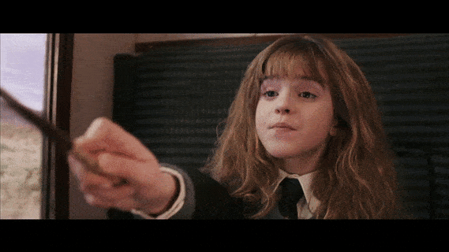
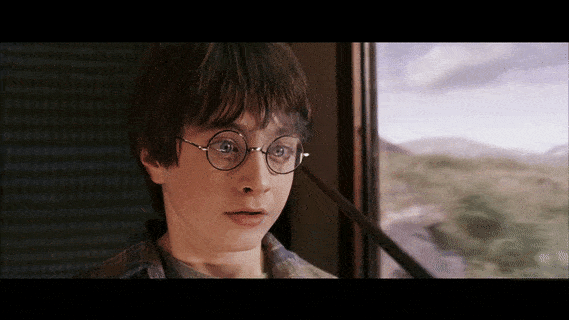
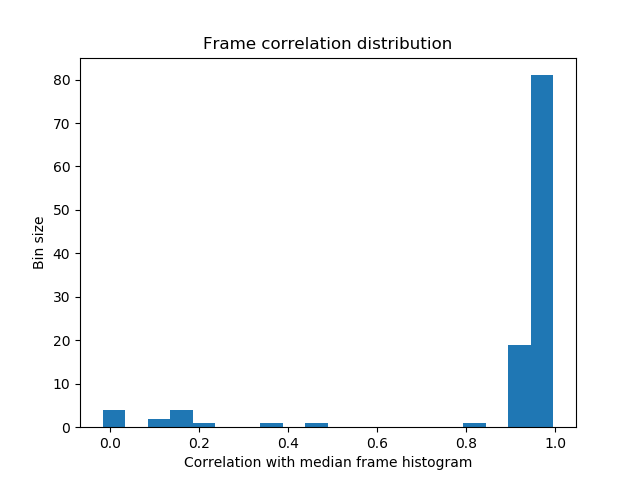
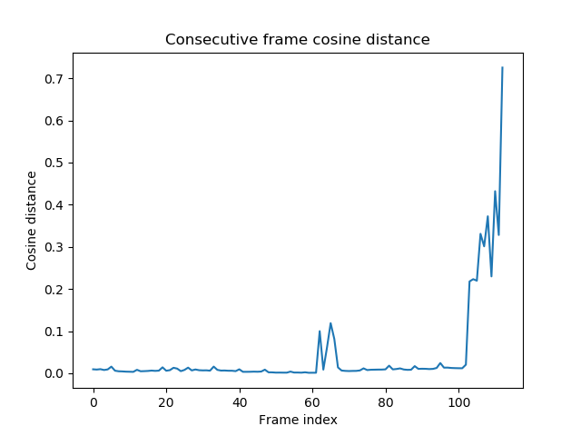
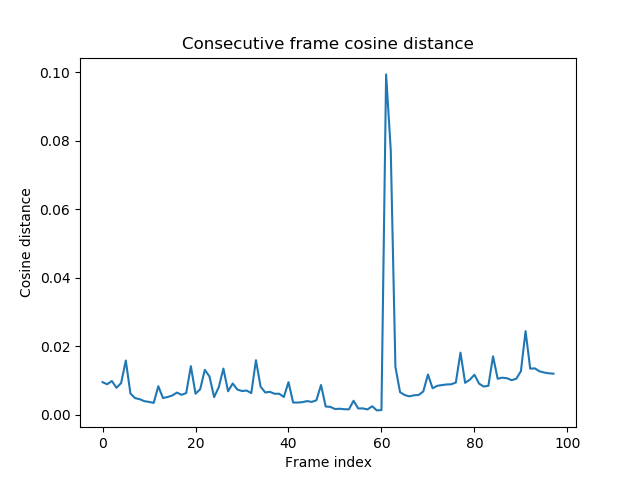

# Video Mender
[](LICENSE)  [](https://www.codacy.com/manual/frgfm/video-mender?utm_source=github.com&amp;utm_medium=referral&amp;utm_content=frgfm/video-mender&amp;utm_campaign=Badge_Grade)   [](https://frgfm.github.io/video-mender)  

Implementation of a frame denoising and reordering algorithm for video sequences.

|             Noisy unordered sample              |                    Restored sample                    |
| :---------------------------------------------: | :---------------------------------------------------: |
|  |  |


> The **Mending Charm**,[[1\]](https://harrypotter.fandom.com/wiki/Mending_Charm#cite_note-POT-0) also known as the **Repairing Charm**[[2\]](https://harrypotter.fandom.com/wiki/Mending_Charm#cite_note-WON-1) (*Reparo*), is a [charm](https://harrypotter.fandom.com/wiki/Charm) that can be used to seamlessly repair a broken object and works on most materials.

*Source: Harry Potter Wiki*


## Table of Contents

- [Getting Started](#getting-started)
  - [Prerequisites](#prerequisites)
  - [Installation](#installation)
- [Usage](#usage)
- [Technical Roadmap](#technical-roadmap)
- [Documentation](#documentation)
- [Contributing](#contributing)
- [Credits](#credits)
- [License](#license)


## Getting started

### Prerequisites

- Python 3.6 (or more recent)
- [pip](https://pip.pypa.io/en/stable/)

### Installation

You can install the package as follows:

```shell
git clone https://github.com/frgfm/video-mender.git
pip install -e video-mender/.
```


## Usage

You can find an example below to process a video

```bash
python scripts/restore.py <PATH_TO_YOUR_VIDEO> --outfile <OUTPUT_FILE> --chain-denoise
```


## Approach

### Removing extra noisy frames

As suggested by this [article](https://www.pyimagesearch.com/2014/07/14/3-ways-compare-histograms-using-opencv-python/), histogram comparison is one way to spot outliers in a frame dataset. Here we assume that some extra unrelated frames can be added to the processed sample.



In this example, there is at least a frame with a correlation above 0.8 but that seems to be distant from the median distribution. However, to be able to generalize, we will set our threshold to `0.65` to handle cases where valid frames have a flatter distribution in terms of correlation.


### Restoring order

Here we will use a codistance matrix to compare frames. Using this method, we can easily avoid the histogram method for outlier filtering.

Within a common shot, with the consecutive frames A --> B --> C --> D, we expect the distance between consecutive as being lower than with distant frames. On a first pass, we take the first unordered frame and iteratively take the best match.



The above shows that this process already provides some structured order, but some frames seem to be unrelated to the original video or to be really badly ordered. Here we remove frames with consecutive cosine distance higher than 5 times the median value, which yields the following:



Now there seems to be only one consecutive cosine distance higher than the others. Here we made our first pass assuming we started with the first frame, which is not likely to be the case. So this remaining outlier is most likely the split between the end of the sequence starting with our uneducated guess.

Using our chaining process again starting from this frame ends up giving promising results.


## Technical roadmap

The project is currently under development, here are the objectives for the next releases:

- [x] Frame processing: process the video frames.
- [ ] Audio processing: use the matching performed on frames to write audio to output as well.
- [ ] Benchmark: add a benchmark of multiple methods.


## Documentation

The full package documentation is available [here](https://frgfm.github.io/video-mender/) for detailed specifications. The documentation was built with [Sphinx](sphinx-doc.org) using a [theme](github.com/readthedocs/sphinx_rtd_theme) provided by [Read the Docs](readthedocs.org).


## Contributing

Please refer to `CONTRIBUTING` if you wish to contribute to this project.


## Credits

This project is developed and maintained by the repo owner, but the implementation was based on the following precious papers:

- [Histogram comparison article](https://www.pyimagesearch.com/2014/07/14/3-ways-compare-histograms-using-opencv-python/): ways to compare picture histograms using OpenCV
- [Scipy](https://docs.scipy.org/doc/scipy/reference/generated/scipy.spatial.distance.cdist.html): scientific computation library for python. 


## License

Distributed under the MIT License. See `LICENSE` for more information.